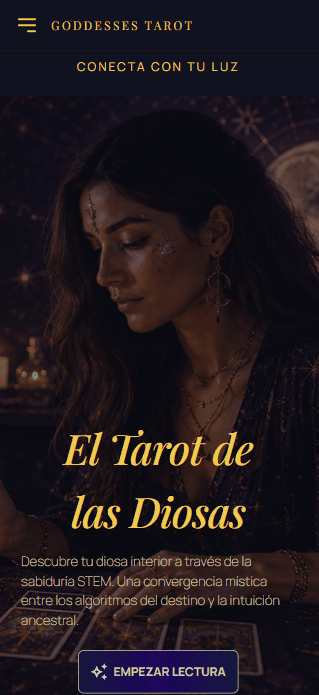

# 🔮 STEM GODDESSES TAROT


> Developed as a collaborative project within the Barcelona-based FemCoders Bootcamp 2026 by FactoriaF5.
---
## 📑 Table of Contents

1. [About](#about)  
2. [Tech Stack](#tech-stack)  
3. [How to Run](#how-to-run)  
4. [Project Tree](#project-tree)  
5. [Presentation & Demo](#presentation--demo)  
6. [Authors](#authors)  
7. [License](#license)

---
## 📋 About

The STEM Goddesses Tarot is an online tarot reading experience that uses a special deck inspired by women in STEM who made history. Check your luck and draw a card for your past, present & future. Try it out!

## 🛠️ Tech Stack

### Frontend Core

- **React (v19)** - Frontend JavaScript library for building the user interface.
- **Sass** - CSS extension language for modular and advanced styling.
- **Vite** - Fast build tool and development server.

### Routing & Forms

- **React Router Dom (v7)** - Handles navigation and routing across the application.
- **React Hook Form** - Efficient, extensible forms validation and management.

### Data & API Management

- **Axios** - Promise-based HTTP client for making API requests.
- **JSON Server** - Used during development to mock a REST API backend.

### Utilities & Tooling

- **React Icons** - Included for easy deployment of popular icon packs.
- **ESLint** - Linting tool used to maintain code quality and consistency.

## 🚀 How to run

Follow these steps to get the project up and running on your local machine.

### Prerequisites

Make sure you have [Node v24.14.1](https://nodejs.org/) installed on your computer.

### 1. Installation

Clone the repository and navigate into the project folder:

```bash
git clone https://github.com/FactoriaF5-Tarot-Team1/GoddessesTarot.git
cd goddessestarot
```

Install dependencies:

```bash
npm install
```

Run the server and the local host:

```bash
npm run json
npm run dev
```

## 🌳 Project Tree

```
GODDESSESTAROT/
├── public/                 # Static assets (favicons, public images, etc.)
└── src/                    # Main application source code
    ├── assets/             # Images, fonts, and data mock files (db.json)
    ├── components/         # Reusable UI components
    ├── config/             # Configuration files (API routes, constants)
    ├── context/            # React Context providers for global state
    ├── hooks/              # Custom React hooks
    ├── pages/              # View components representing distinct routes
    ├── services/           # Data fetching and API services (Axios instances)
    ├── styles/             # Global styles and Sass stylesheets
    ├── utils/              # Helper functions and utility logic
    ├── App.jsx             # Main application component & router shell
    └── main.jsx            # Application entry point
├── index.html              # HTML template entry point
├── package.json            # Project dependencies and scripts
└── vite.config.js          # Vite configuration
```

## 🎤 Presentation & Demo
Watch the official project presentation [here](https://canva.link/d6v1i52domcqb58).




## 👩‍💻 Authors

Made with 💜 by:

- [Ivanna Caraccio Ayala](https://github.com/IvannaRCA) - Product Owner & Developer
- [Aïda Garcia Musté](https://github.com/AidaG91) - Developer
- [Elena Almansa Campos](https://github.com/elenaalmansacampos) - Scrum Master & Developer
- [Rosa Naharro Vaillant](https://github.com/rosana50factoria) - Developer
- [Chiara Di Maio](https://github.com/Kressala) - Developer

## 📄 License 
This project was developed for educational purposes within the FemCoders Bootcamp 2026.
